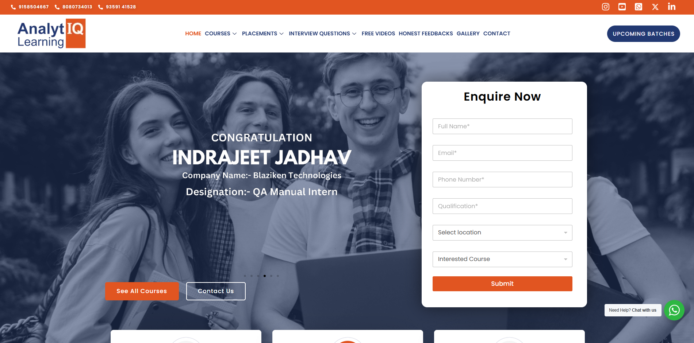

# Analytiq Learning

- **Client:** Analytiq Learning
- **Website:** [analytiqlearning.com](https://analytiqlearning.com/)
- **Industry:** IT Training & Education
- **Technology Stack:** PHP, MySQL, WordPress, WooCommerce, Elementor, Astra Theme

### 🏢 About the Client

Analytiq Learning, located in Pimpri Chinchwad, is a prominent institution dedicated to empowering future IT professionals through providing excellent training programs. Their vision is to equip students with real-world skills that enable them to thrive in the IT sector. They contacted us to create a professional, interactive, and easy-to-use website that would represent their values, enable course enrollments, and provide an interactive online learning experience.

### 🚧 Challenge

The biggest challenge was to create and implement a contemporary website that not only offered crucial information regarding their products but also had course registration and e-commerce capabilities seamlessly incorporated into it. The website should:

- Offer an uncluttered user experience, especially for first-time students seeking to explore different IT training programs.
- Offer a visually stimulating design that would also reflect the company's emphasis on innovation and future-proofed IT skills.
- Implement an e-commerce platform to manage course enrollments, payments, and monitor students' progress.
- Be scalable with ease, enabling Analytiq Learning to expand its courses and student numbers over time.

### 💡Our Solution

In order to address the client's needs, we employed a blend of WordPress, WooCommerce, and Elementor in conjunction with the Astra theme, offering scalability, flexibility, and customization capabilities.

### 🎨 Website Design and User Experience:

We emphasized building a clean, minimalistic design with simple navigation so that visitors can easily locate information they require within a short amount of time. The design was responsive, so the experience remains smooth on desktop, tablet, and mobile viewing. We incorporated the Astra theme for maximum flexibility in design and combined it with Elementor for drag-and-drop functionality for customization, with the ability to have a visually appealing website without sacrificing performance.

### 🧑🏻‍💻Course Listings and E-Commerce Integration:

To enable students to browse courses, we installed WooCommerce to handle course listings, process online payments, and deliver a seamless checkout experience. Students can now browse course information, select the programs that best fit their requirements, and pay online securely. The powerful features of WooCommerce ensure course registrations are processed seamlessly, and payments are securely processed.

### ✨Custom Features for Student Engagement

We incorporated interactive features like student feedback, success stories, and an FAQ section to establish credibility and maintain potential students' interest. These features allow for a sense of connection with the target market while giving them useful information.

### 🧑🏻‍💻Course Management and Backend Customization

We tailored the site's backend to suit Analytiq Learning's administrative staff for simple management of course offerings, tracking student registrations, and changing content. They can add new courses, revise course timetables, and monitor student progress using the simple dashboard without the need for technical skills.

### 📈 Results  

Analytiq Learning has experienced a number of positive developments since the site was launched:

- **Increased Student Enrolments:** Seamless integration of WooCommerce has resulted in a remarkable hike in course registrations due to the user-friendly online payment system.
- **Enhanced User Interaction:** Modern and visually responsive design has enhanced visitor interaction with more time being spent on the website and a higher rate of conversion.
- **Functional Efficiency:** Simple backend system has reduced administrative overheads, and Analytiq Learning can devote more time towards providing quality education to their learners.
